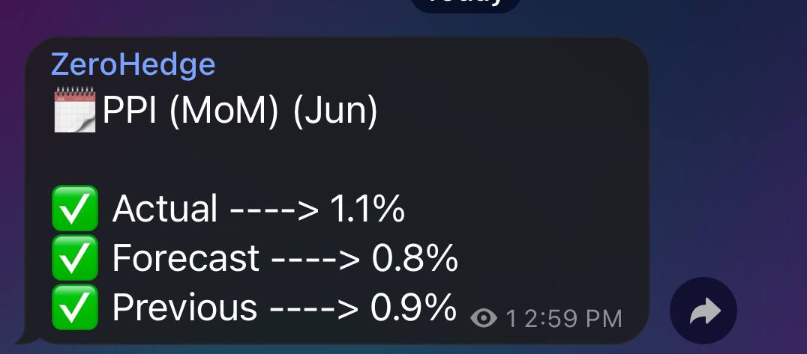

-----
**[Investing.com](https://investing.com/)** is a financial markets platform providing real-time data, quotes, charts, financial tools, breaking news and analysis across 250 exchanges around the world in 44 language editions.


An **[economic calendar](https://www.investing.com/economic-calendar/)** is a resource that allows traders to learn about important economic information scheduled
to be released in major economies. Such events might include familiar indicators such as GDP, the consumer price index (CPI), and the Non-Farm Payroll (NFPs) report. Further,
in today’s environment of fiscal cliffs and central bank intervention,
it can be very helpful to know the date of the next
central bank meeting or major news announcement.

# Telegram post preview



# Installation 

    pip3 install -r requirements.txt


# Run bot 

* 1- First of all, you should make a telegram bot, if you
don't know how, you can watch this useful tutorial video[[here]](https://www.youtube.com/watch?v=CNkiPN_WZfA)
  
<br />

- 2-Then place your **telegram token** and **telegram channel ID** in the **Telegram.py** file

```python
    base_url = "https://api.telegram.org/<'YOUR-TOKEN'>/sendMessage"
    parameters = {
        "chat_id": "@<'YOUR-CHANNEL'>",
```

# heroku 

If you want your bot to work all the time, deploy your code on **[heroku](https://www.heroku.com/)**


<a href="https://github.com/oxlupo/Economic-Calendar-telegram-bot">
  
</a>

[](https://heroku.com/deploy?template=https://github.com/oxlupo/Economic-Calendar-telegram-bot)